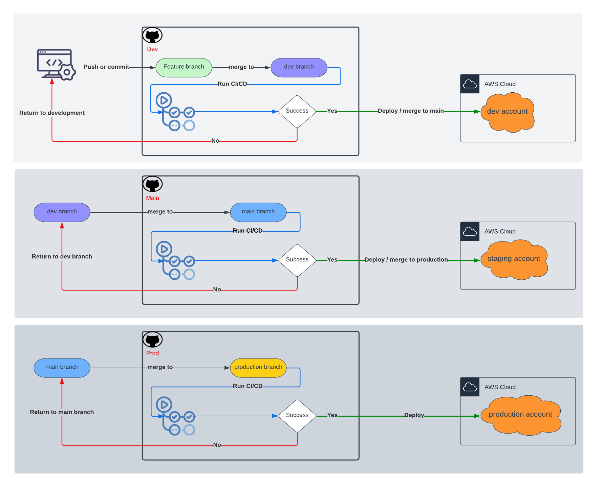

# About
Gitflow is a branching model that allows teams to collaborate on a codebase while keeping their changes separate. 
It provides a standardized way to manage branches and releases in a software development project.
 
This section describes the gitflow model that includes a developer developing a feature branch and opening a pull request
(PR) to a branch named "dev", running linters and test cases using Github Actions,
deploying to dev account, merging dev to `main` branch, deploying to staging environment,
merging main to `production` branch, and deploying to production environment using Github Actions.
## Gitflow Model
The gitflow model has three main branches, the `main`, the `production` and the `dev` branch.
The production branch represent the stable production code
The main branch represents the staging
code (linking between dev and production), while the dev branch is where new features are integrated
and tested before they are merged into the main branch.
### Feature and Development Branches
When a developer starts working on a new feature, they create a new branch from the dev branch.
This new branch is called a "feature branch" and is used to isolate changes related to a particular feature. 
Developers can work on this branch, make changes, commit them, and push them to the remote repository.

### Opening a Pull Request
When a developer finishes working on a feature, they open a PR to merge their changes to the `dev` branch.
This PR triggers Github Actions to run linters and test cases to ensure the code meets the project's standards and does 
not introduce any regressions. If the PR passes all the checks, the changes are merged into the dev branch and deployed
to the dev environment.

### Merging Dev to Main Branch
After the changes are tested and deployed to the dev environment, the `dev` branch is ready to be merged into the
main branch. This is done by opening a new PR to merge the `dev` branch into the `main` branch. This PR can only be opened 
from the `dev` branch, and the *`main` branch can only accept PRs from the `dev` branch*.

### Deploying to Staging Environment
After the changes are merged into the `main` branch, a Github Actions workflow runs to deploy the code to the staging
environment. The staging environment is a testing environment that is as close as possible to the production environment.

### Merging Main to Production Branch
After the changes are tested and deployed to the staging environment, the `main` branch is ready to be merged into
the `production` branch. This is done by opening a new PR to merge the main branch into the `production` branch.
This PR can only be opened from the main branch, and the*`production` branch can only accept PRs from the main branch*.

### Deploying to Production Environment
After the changes are merged into the production branch, a Github Actions workflow runs to deploy the code to
the `production` environment. The `production` environment is the final environment where the code is available to end-users.

# Conclusion
The gitflow model provides a structured way to manage the development, testing,
and deployment of software projects. By using feature branches, PRs, and different environments, 
teams can work on new features without affecting the stability of the production code. Using Github Actions to automate
the testing and deployment process saves time and ensures the quality of the code. By following the gitflow model, 
teams can ensure a high-quality codebase that is ready for production.

